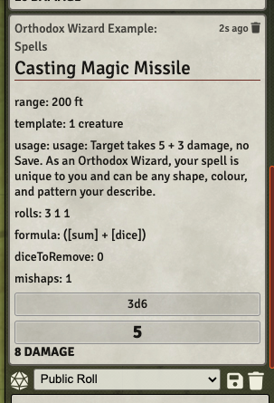

# FOUNDRY GLOG GUIDE 

Welcome to the [Foundry guide for glog](https://github.com/matfournier/glog) which is based on [Skerples Glog: Many Rats on a Stick](https://www.reddit.com/r/osr/comments/dolhjs/glog_v2_many_rats_on_sticks_skerples_has_updated/). This guide does not cover the rules but covers how to use Foundry to play glog.

To install: 

* go to [foundry glog](https://www.reddit.com/r/osr/comments/dolhjs/glog_v2_many_rats_on_sticks_skerples_has_updated/)
* in foundry go to systems
     - in the [system.json in the glog github](https://github.com/matfournier/glog/blob/main/system.json) copy the url to this file
     - paste that link into the manifest URL and install
* start a new world using GLOG 

## FEATURES

The sheet aims to automate some of the work for a player such as making it obvious where things go (item management), somewhere to put the stats, etc:

* stat bonuses are calculated based on the tables in many rats on a stick
* items have slots and can be in quick slots or slow slots 
* encumbrance is applied when over the slot limits 
* fatigue is applied to slot limits 
* stats (str/dex/etc) and abilities (attack/def/save) are rollable and give ui popups
* weapons are rollable giving the option to attack or do damage
* spells are rollable 
    * spells can be defined in the glog spell languege, e.g. damage as `[sum] + [dice]` and it will be automatically substituted for you 
    * spell dice burned, doubles (mishaps), triples (dooms), and quadruples are highlighted 
* items/classes/skills/effects can have one or more status effects
    * for example, +1 str, or -2 quick slots, or +10 range modifier (from a hunter skill) 
    * miscelleneous effects can also be applied (e.g. being skullcracked from an injury and having -6 wis for iniative) 
* combat initiative is built into the foundry combat roller based on the many rats on a stick rules 
* a simplified NPC sheet is provided for the GM 
    * fields can be autopopulated from HD for a quick first approximation of statistics 

However the sheet isn't _too automated_.  The inputs are actually quite abstract, which is why this guide exists to show how it all works.  GLOG is a lot of things and it would be nice to capture as many hacks as possible.  If a hack is too far from many rats on a stick it probably wouldn't work, but you would be surprised at how much you can get hacks like [Die Trying](https://meanderingbanter.blogspot.com/2019/02/die-trying-v1.html) working.  The hope is further development will make it available to have more configuration options to have these hacks.

Speaking of configuration options, you can turn off some of the sheet's functionality under the TWEAKS section: 

* maybe you want to calculate stat bonuses different, you can turn off automatic stat bonus calculation and switch it to manual entry
* maybe you want to calculate dev/save/attack differently, you can turn off automatic calculation of these 
    * this is handy even for some many rats on a stick classes like the Sorceror who has special rules for `Save`.

At the end of the day nothing in one sheet can affect another sheet. It just gives you information and rolls it.  You still have to manually subtract HP, add statuses, remove dice from your dice pool from burned dice from spells, etc.  

## The PC Sheet 

The pc sheet is broken into several sections: 

* a header displaying generally useful information: hp, health, level, movement, etc. 
* a stats section where you will find attributes, stats, immunities, fatigue, etc. 
* an effects section which has a summary of all the modifiers affecting your character
* an inventory: weapons, equipment, consumables, loot 
* a spell setion
* a biography

1. The tweaks section where you can turn off some automatic calculations
2. Level and XP are fields you can enter 
3. Health has min/max and you have to enter it yourself. Not autocalculated.  The two 0 / 0 fields beneath it are if you need to enter a temporary health (due to a spell, condition, environment, who knows!) 
4. Movement: regular movement and run distance.  Also has handy buttons for lunch and rest as per the rules.
4. (repeated woops): Stats!  The big number is the base value. 
    - for attributes, there are three numbers across the bottom: 
        - lower left: the bonus 
        - middle: any modifiers (from races, equipment, etc.)
        - right: the total
    - for skills (e.g. attack)
        - lower left: any modifiers (from races, equipment, skill) 
        - right: the total 
5. Resources:  there are six, they can be whatever you want them to be. You can type to change the titles. Who knows what you will use these for with some classes.  For spell casters it sets up the defaults.
6. Fatigue: Enter on the big value.  Lower left is modifiers (from races, equipment, skills).  Lower right is total.  Affects slots.

### PC Tweaks 

 

If you open the PC tweaks you can turn off automatic computation for fields.  This changes the sheet slightly.  In the example, strength is turned off so you can now edit the value in the lower left (the bonus value).  Defense calculation is also turned off so you can now edit the value directly.

### PC Inventory

Inventory is separated out by weapon, equipment, consumables (lights, wands, scrolls, bottles, etc), and loot 

1. Hovering over the icons will turn into a dice. If you click the dice it will roll the item.  If the item has any rollable actions (such as attack, or damage, or spell, or effect) it will present those options in a dialogue box.
2. Shield means equipped (but not necessarily in your quick slot!).  Scribble means edit.  Trashcan means delete.  Add is add. 
3. If an item has limited uses they are shown here.  You can edit the bolded value. 

If you click on an item name, the item description will drop down beneath it: 

If you click on the rollable icon of the item, you get something like the following: 

### PC Features

 

PC features are similar to items and are broken down by class, race, and skills.  Some of these may also be rollable and have rollable actions.  The class/race are  used to fill in the actor description: on a blank sheet they will be the ??? ????. 

### PC Spells

 

The PC spells show all the spells the user has access too in a few sections: cantrips, spells, and alternates.  Each spell has a type:

* cantrip
* brain
* spellbook
* alternate 

Depending on what they are.  Some spells have alternate modes and the system is a little clunky here.  Look at the description for Force Wall in the rules for Orthodox Wizard.  It has two modes.  Unfortunately this means it has to be entered as two spells.  To help keep track and not count it as two spells against the total, one is tagged as an alternate for now.

You can click on a spell to roll it.  Some spells just do damage. Some do an effect but no damage.  Some could also have an attack (e.g. some sort of chilling touch where you must make a melee attack before being able to do damage).  How an item/spell/effect is entered controls what actions are available.

### Entering Items / Rollable actions 

How an item/spell/skill is entered controls what actions are available.  

If we make a weapon and look at it we see the general item description tab: 

* you can edit the description
* you can edit the number of slots per item 
* you can give the item a price: e.g. 1GP, 40SP, whatever you are using your system
* you can give it a source, in my case it came from Many Rats on a Stick
* all weapons/consumables/races/skills/spells have this sort of display 

The details are where things get interesting. Each type of thing will have a specific part and also some shared pieces:

* weapon details (specific to weapons)
* weapon attack (this section is called Actions and will be present for many kinds of items).  This is where you enter the actions a thing may have: e.g. attacking and doing damage
* usage details (generally speaking items won't have these)
* self stat effects - e.g. if it makes you clumsy and gives you -2 dex or something 

This a lot: 

 

But don't despair. Most of the time most of the fields are empty.  Take this example:

* we are equipped 
* we are also in a quickslot 
* we are not proficient (so we will attack at -4) 
* our weapon has some properties (these are just tags, they have no mechanical effect) 
* our weapon attack has no additional action (e.g. it doesn't _cause a spell_) 
* our weapon's damage is modified by our strength bonus 
* it does 1d8+1 slashing damage (the +1 is due to us entering it as +1 because it is our weapon type for the notches skill) 
* it has no secondary damage (but if this was a bastard sword, this is where you would the alternate damage mode so you could switch between 1h and 2h damage rolling easily) 
* it does have an automatic status effect:
    - it gives us +1 to our melee crit range so we crit on a 1-2 
    - it ONLY applies to this item's roll
        - the other option is to set it to GLOBAL to affect _all rolls_ 
        - e.g. this is how you differentiate between this sword vs. say a Ring Of Slaying (+1) giving you +1 attack on all rolls, not just the items rolls
* applied means it's counted for automatic stats 
    - if it was not applied, the stat would not be counted
    - this is how you cound something with an activation that is only _temporarily on_, perhaps it's some magic device? 

Onto armour:

It has the same item description sheet as weapon where you can enter a description, weight, price, etc.  It also has a details tab:

* we can pick whether or not it's armour (leather/chain/plate) or some sort of trinket/other.
* we can set it to equipped (worn) and/or quickslot.  For this piece it's obvious it's not a quick slot --you are wearing your armour.  But if this was a shield and you wanted to be using it then it would be both equipped and in your quickslot and thus be counted in different slots 
* it has no usage details (e.g. a range, a template, a duration, a consumption) 
* it has no additional actions (but it could if it was magically) 
* it causes no damage (but it could --maybe this is where you would put something like a shield bash on a shield for 1d4 damage or something)
* it has no self stat affects (but it could if it was magically)

Onto Consumables:

We see the same standard description sheet with a quantity and slots field

Looking at details:

 

Woah this looks complicated.  Let's walk through it.  

- our consumable is a light (not a potion, or a scroll, or an other)
- it's in our quick slot (which implies equipped) 
- it has a usage detail! an action! 
    - we can throw it according to the condition
    - it has a range of 10ft before the -1 penalty applies 
    - it has 3 charges (it's loaded with a flask of oil, a charge lasts 1 hour)
- it has a ranged attack being thrown
    - it does 1d6 damage if completly full of oil
    - it does 1d4 damage if not completely full of oil
- it has no stat effects

If we click on it from the inventory screen to roll it:

 

We see we can make a ranged attack with it (which will enter into the ranged attack flow asking for a range and then telling us if we succeeded or not).  Or we can roll the damage.  Or we can roll the alternate damage.

Oops we tried to throw it 30 feet and didn't hit: 

Looking at spells:

- it has a description area (uninteresting, doesn't have slots/price,etc) 
- it has a casting text: this is shown when you roll the item 

We have details:

 

- it's in our brain (as opposed to a cantrip or in our spellbook)
- we have an action
- it targets 1 create
- it has a range of 200 ft 
- it has no additional action (like an attack roll) 
- it has no damage modifier
- it does `[sum] + [dice]` damage.  Note: the parser is pretty stupid, white space matters, but you get the gist.  
    - you can also give it a normal roll for damage: e.g. 2d8 
    - you can also give it flat damage: e.g. 10 
    - see Spell Language section 

We can now roll the item by clicking on the spell's icon:

and get asked how many dice we want to power it up with 

 

And the result is displayed in chat:

 

- it has taken the spell casting text and put it in as the usage 
    - it has substituted the `[dice]` and `[sum]` with the actual result
- it has put in some of the details like the range and the template
- it shows us the roll (3, 1, 1) 
- it tells us the damage formula
- we didn't burn any dice (no 4,5,6)
- we have one double (mishap)
- we did sum + dice damage = 5 + 3 = 8 damage

Not all spells do damage:

We can also enter as little as we want, maybe the casting text covers us off.  In this case we enter `[effect]` for the damage to indicate
we are not doing any damage, just casting for effect.  If we cast it and power it up with 3 dice again we see the following:

Hopefully you see how flexible this system is. 

#### Spell Language 

understands:

- `[sum]` - the sum of the roll 
- `[dice]` - the number of dice used in a roll
- `[best]` or `[highest]` the highest dice of a roll
- `[worst]` or `[lowest]` 
- `[effect]` if we do no damage and are just casting for effect

It's pretty dumb. `2 * [dice]` is a valid damage formula.  `2*[dice]` is not.  You also can't do `1d6 + [sum]`.

### EFFECTS

Saved this for last because you kind of need to see the rest of the sheet to understand it.  If you pull in the Fighter example from the compendium and go to the effects you see: 

1. a summary of all the modifiers applied to the character

The other section has four sections: 

- Manual effects where you just want to track something but it has no automatically calculated effect.  In this case, our fighter gets +1 attack per round and this is just a handy place to store it 
- Auto Applied effects where these DO have some sort of automatic calculation.  They can equipped or not equipped (if not equipped, they don't get counted, e.g. for things that are temporary).  In our case we've got some injuries, this is where we would track it! 
- if any items/equipments/etc. was equipped that had a stat ability, this is where it would show up 
- if any items/equipment/etc. had some sort of manual stat thing to track (e.g. not automatically calculated) this is where it would show up.

## Compendiums

If you go to the compendiums section of Foundry, you will see: 

- GLOG-ITEMS
- GLOG-WEAPONS
- GLOG-EQUIPMENT

These have some predefined things you will find handy.

- GLOG-CLASSES

Has some example inputs for: fighter, hunter, orthodox wizard which should give you enough ideas of how the system works to enter any class (or hack!) that you want.

# GM STUFF

## NPC SHEET

The NPC sheet is drastically stripped down from the PC sheet and pretty simple dumb:

- it doesn't really do any automatic calculation stuff
- it has way less inputs 
- none of that self-stat effect stuff is calculated (just... put it in the stats directly) 

 

See. Simpler.  Just enter the values you want to enter directly.  Some things to point out: 

- you can enter an HD 
- if you click on the HD text it will generate melee, range, defense, save, MV based off that HD 
    - this is handy for a rough approximation to start tweaking from 
- you can override the hitpoints (default is [hd]d8).  You can type into the override hP roll a formula like 4 + 3d6  and then click HITPOINTS to reroll it

- if you click on morale you will roll a morale check

NPC features are simplified as well: 

## GM TOOLS

In progress

 

